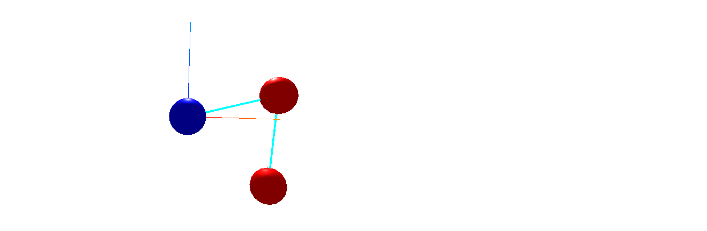

=======
Neo-ODE
=======

This is a package for the numerical solution of ordinary differential equations.
It has been forked from `ASC-ODE <https://github.com/TUWien-ASC/ASC-ODE>`_.
For linear algebra, the package uses Neo-CLA.

Neo-ODE makes it easy to solve ODEs with different kinds of using different kinds of methods.

.. code-block::

    double tend = 4*M_PI;
    int steps = 100;
    Vector<> y { 1, 0 };
    auto rhs = make_shared<MassSpring>();
    
    SolveODE_IE(tend, steps, y, rhs,
                 { cout << "IE " << t << " \t " << y(0) << " \t " << y(1) << endl; });

The following algorithms are available:

- Explicit Euler
- Implicit Euler
- Crank-Nicholson
- Generalized Alpha
- Newmark

Functions are specified with the built-in function algebra implementation:

.. code-block::

    func = Id + 3 * Compose (f, g);

There is also an integrated plotting utility: `demos/plot_test_data.py <https://github.com/kajamia/Neo-ODE/blob/main/demos/plot_test_data.py>`_.
It is given a command as argument, parses the output of that command as csv and plots that output (the solution function).

.. code-block:: bash

    ./plot_test_data.py ../build/test_RC

Installation
============

.. code-block:: bash

    git clone --recurse-submodules https://github.com/kajamia/Neo-ODE.git
    mkdir build
    cd build
    cmake ..
    make
    cd ..
    pip install . # install Neoode
    

.. toctree::

    Neo-ODE<self>
    functions
    solvers
    mass_spring
    network
