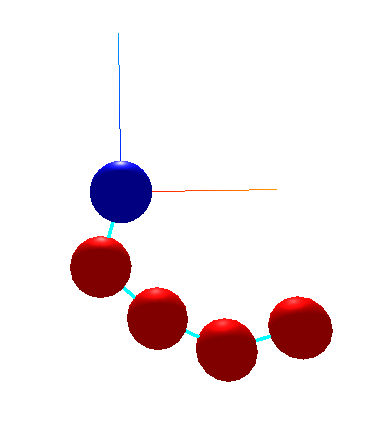
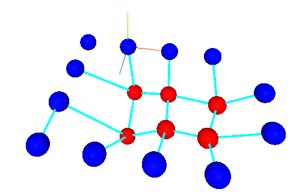

=============================
Use case: Mass-spring systems
=============================

Neo-ODE can be used to simulate mass-spring systems. Working examples can be found in the mass_spring directory of the project.
All kinds of geometries can be created:

Fixed points are blue, point masses are red and springs are turquoise.
These examples can be found in Jupyter notebooks within the mass_spring subdirectory.