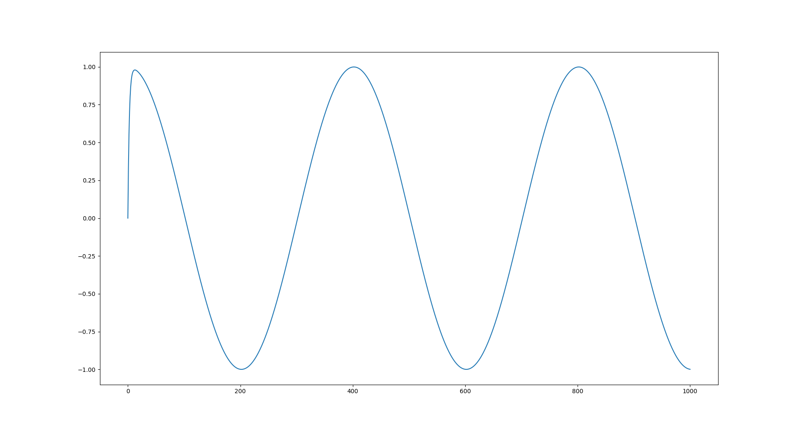

===========================
Use case: Electric networks
===========================

Neo-ODE is also suitable for solving differential equations in electrodynamics,
for example simulating voltage in an electrical circuit (see `test_RC <https://github.com/kajamia/Neo-ODE/blob/main/demos/test_RC.cc>`_):

All time-steppers have proven to be sufficiently accurate for this.